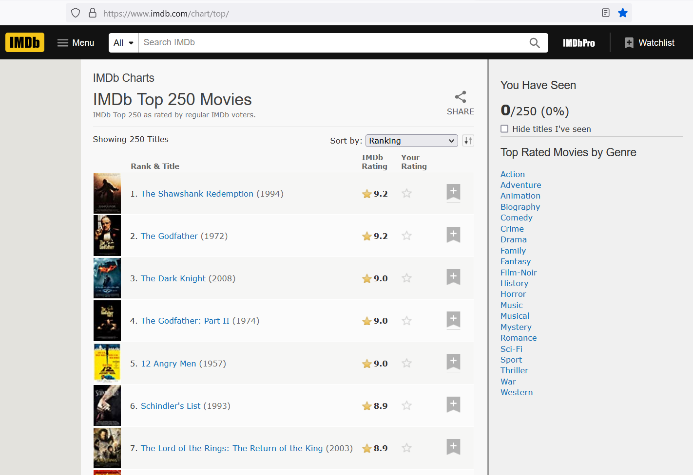
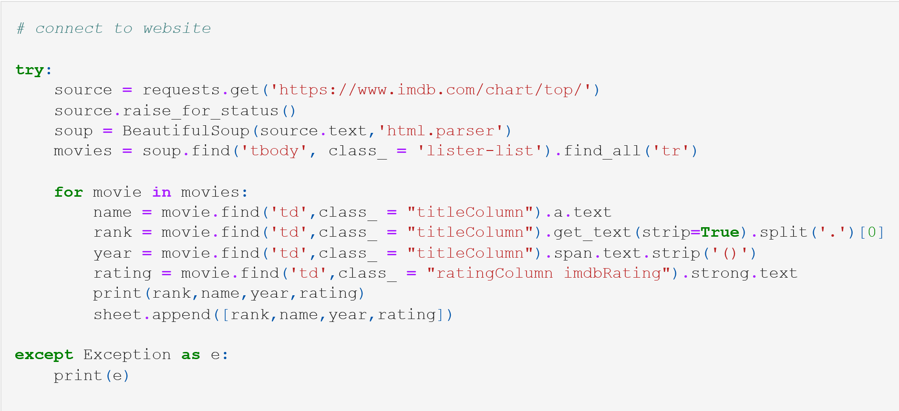
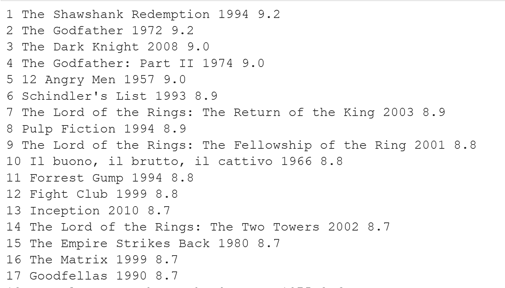

# IMDb-Web-Scraping
#### Scraping IMDb website using Beautiful Soup and Request Library

* Loading libraries
    
    we start by importing Beautiful Soup and the Requests library  
    **Beautiful Soup** is a Python library for pulling data out of HTML and XML files. It works with your favorite parser to provide idiomatic ways of navigating, searching, and
      modifying the parse tree. It commonly saves programmers hours or days of work.  
    **Requests library** is the de facto standard for making HTTP requests in Python. It abstracts the complexities of making requests behind a beautiful, 
    simple API so that you can focus on interacting with services and consuming data in your application.

    

* Creating an Excel file
    
    the result of the get request is stored in an Excel file 
    
     
* Connecting to the website
    
    using requests.get() method, we are getting the desired web-page and store in a variable named source
    now we will look for particular tags using a for loop which will iterate to all the movie information we stored in the variable

    
    
     
* Saving results in the excel file
    
     
    
